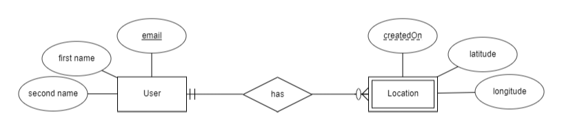

# User Location Simple API

It is a simple spring boot project including some restful APIs which store and retrieve user locations information. It
Uses memory-based database (H2 Database) so just clone and run it.

## Requirements

- Java 17
- Spring Boot
- Gradle

## Use Cases

This project consists of User and Location entity. There is a user service for add and update users.
Also, three services are implemented to store locations, get last stored location of user, 
and get locations of user based on a range of date.

Location entity has related user ID, latitude, longitude and a date which the location is created for user.
The relation between user and location is one to many which means, a user can store many locations.

simple erd is shown below:

## Test (Version 2)
The [postman collection](user-location.postman_collection.json) is provided. After running the project, use these API calls for different use cases:

### Store a new user

- PUT request to: `http://localhost:8082/user-location/v2/users`
- JSON example: `{
  "email": "email@email.com",
  "firstName": "Bob",
  "secondName": "Jully"
  }`

### Update a user

- PUT request to: `http://localhost:8082/user-location/v2/users`
- JSON example: `{
  "userId": "user id to update",
  "email": "email@email.com",
  "firstName": "BobUpdated",
  "secondName": "JullyUpdated"
  }`

### Add location for a user

- POST request to: `http://localhost:8082/user-location/v2/users/locations`
- JSON example: `{
  "userId": "user id to add location",
  "createdOn": "2024-04-04T04:04:04.0",
  "location": {
  "latitude": "52.0",
  "longitude": "13.0"
  }
  }`

### Get last location of a user

- GET request to: `http://localhost:8082/user-location/v2/users/{userID}/locations-last`
- response example: `{
  "userId": "userID",
  "email": "email@email.com",
  "firstName": "Bob",
  "secondName": "Jully",
  "location": {
  "latitude": 52.0,
  "longitude": 13.-
  }
  }`

### Get locations of a user based on a range of dates

- GET request to: `http://localhost:8082/user-location/v2/users/{userId}/locations?from={fromDate}&to={toDate}`
- response example: `{
  "userId": "userID",
  "locations": [
  {
  "createdOn": "2024-04-04T04:04:04.0",
  "latitude": 52.0,
  "longitude": 13.0
  },
  {
  "createdOn": "2024-04-04T14:14:14.0",
  "latitude": 53.1,
  "longitude": 14.2
  }
  ]
  }`

## API docs
API docs is generated using OpenAPI and Swagger UI. After running the project, check the link:
- [http://localhost:8082/user-location/swagger-ui/index.html](http://localhost:8082/user-location/swagger-ui/index.html)

## Unit/Integration Tests

More than 30 tests are written as below:

### Location Service Tests
- `A new user is added and a Location created for it. Then location is added and its value is asserted.`
- `A location is unique by its user and createdOn date. Add the duplicate location, must result updating.`
- `Three location added for user and last location of user is returned and asserted.`
- `For a user which has no location, getting last location, return nothing.`
- `Three location added for user and all locations of user based on range of date are returned and asserted.`
- `Given a user with no location, when getting locations by range of dates, an empty list is returned.`

### User Service Tests
- `A new user data is created. Then User is added. Finally new user values are asserted.`
- `A new user data is created with null values. Then adding it must throw exception.`
- `A new user with a duplicate email is adding and must throw exception because email is unique for users.`
- `First and Second names of existing user are updated. Finally updated values are asserted.`
- `A user with invalid ID is updated. Then a NotFoundException is thrown.`
- `A new user created and using its ID, new Location will be added for it.`
- `An Invalid user ID is used to add a new location. Then a NotFoundException is thrown.`
- `A duplicate location with same createdOn added. Then must update the location.`
- `Two locations added for user. Then Last location for user with given Id must be return.`
- `If user has no location, when getting last location, then it must return an error.`
- `Three locations added for user. When getting locations by range of date, then a list must be returned.`
- `For a user with no location, when getting locations by range of date, then empty list must be returned.`

### User APIs Tests
- `PUT a new user valid info and it status is 201.`
- `PUT a user with null values, the it responses binding error and message is asserted.`
- `PUT a new user with duplicate email, then it responses database error and message is asserted.`
- `PUT request to update existing user values and it status is 200.`
- `PUT a user with invalid ID to update. Then response is NotFound error.`
- `POST a new Location for an exist user and response status is 201.`
- `POST a new location for an invalid user ID, then response is NotFound error.`
- `POST a new location with null values, then it responses binding error and message is asserted.`
- `POST a new location with createdOn date of future date, then it responses binding error and message is asserted.`
- `POST a new Location with duplicate createdOn date and it responses updated location.`
- `GET last location of a user when exist then response is OK.`
- `GET last location of a user when there is no location then response is NotFound.`
- `GET a range of locations of a user by date, then a list of locations is returned and response is OK.`
- `GET a range of locations of a user when it is not exist, then status is NoContent.`
- `GET a range of locations of a user when the date range is not valid, then responses error.`